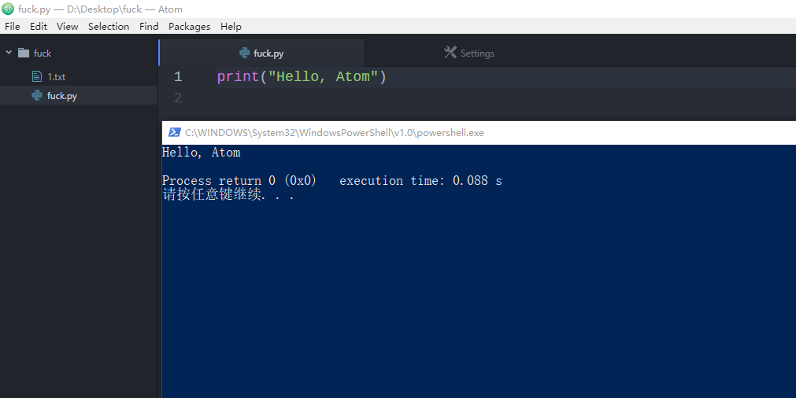

# run-python-simply package

Run a python file in cmd or Powershell.

# Prerequisite

- Windows
- Python 3 in `PATH`

# Method of use

1. Open a `.py` file.
2. Hit `F5` to run.

- **It will save the file in current editor immediately without a confirmation, be aware.**

# Features

- cmd or Powershell
  - Two options for you, cmd and powershell. Choose one you like!
- CodeBlocks debug console style
  - Show return value and execution time
    - It is a rough time based on real time rather than CPU kernel time or CPU user time

Thanks to [atom-python-run](https://github.com/techstay/run-python-simply), I learned a lot from it.

